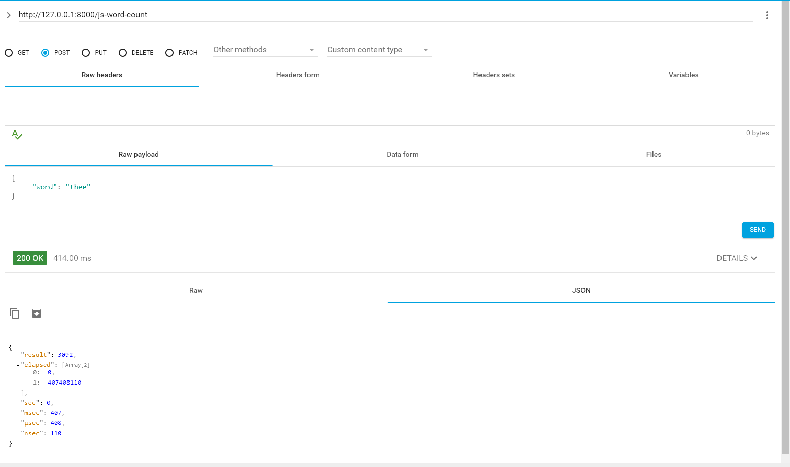
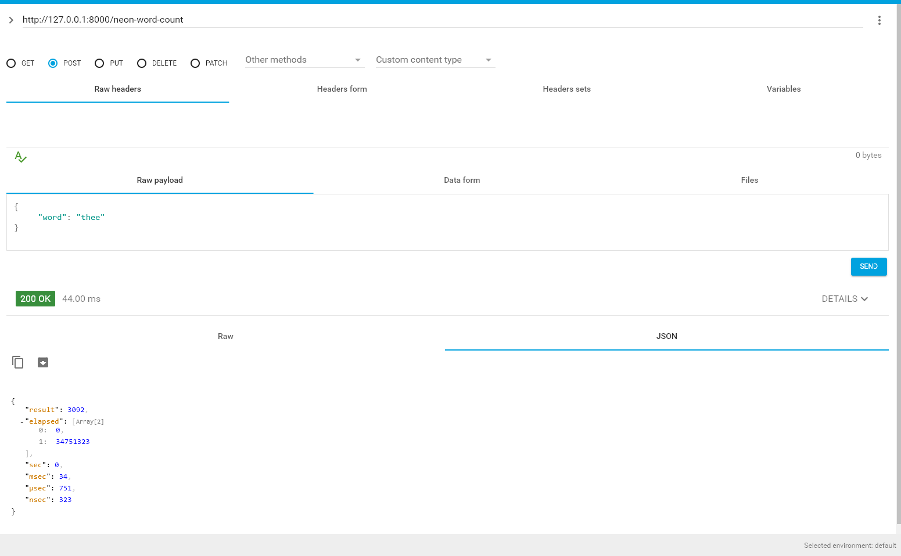

A simple word-counting demo to showcase Neon.

## Please Install Rust 1.18.0
https://www.rust-lang.org/en-US/

## Setup:
See the [requirements for Neon](https://github.com/rustbridge/neon#requirements)

## Run:
npm run run-demo


## API Examples:
```
http://127.0.0.1:8000/js-word-count

{ 
     "word": "thee"
}
```


```
http://127.0.0.1:8000/neon-word-count

{ 
     "word": "thee"
}
```

